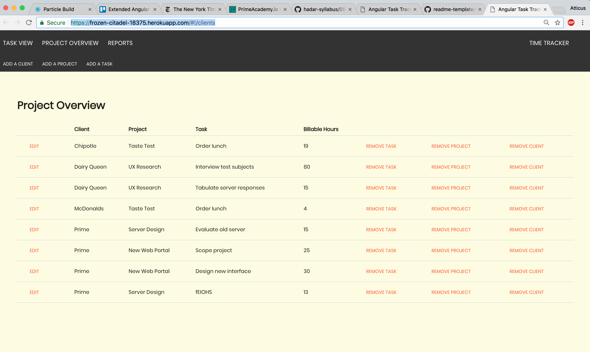
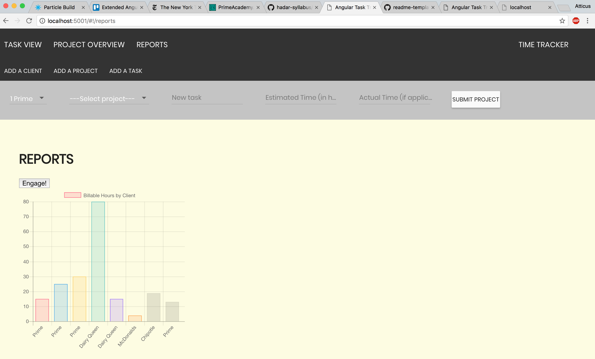

# PRIME TIME TIME TRACKER

The PRIME TIME TIME TRACKER single-page application allows the user to track clients, projects, tasks, estimated hours, and actual billable hours with ease. Billable hours can be displayed in the form of a bar graph. Clients, projects, and tasks can be added and removed from the databse simply and efficently. A cascading delete automatically removes all projects and tasks associated with a removed client. 


Live on Heroku: 
https://frozen-citadel-18375.herokuapp.com/#!/clients





## Built with:
- AngularJS
- PostgreSQL 
- Node.JS
- Express
- AngularJS Material
- ChartJS


### Setup: 
To run this app on your local server simply run 'npm install', create and populate these tables in PostgreSQL, and open 'http://localhost:5001/' on your browser of choice. 


```SQL 
CREATE SCHEMA time_tracker;

CREATE TABLE time_tracker.clients (
    id SERIAL PRIMARY KEY,
	client varchar (120) 
);

CREATE TABLE time_tracker.client_project (
    id SERIAL PRIMARY KEY,
    client_id INT REFERENCES time_tracker.clients (id) ON DELETE CASCADE,
    project varchar(120)
);

CREATE TABLE time_tracker.project_task (
	id SERIAL PRIMARY KEY,
	project_id INT REFERENCES time_tracker.client_project (id) ON DELETE CASCADE,
	task varchar (80),
	est_time INT,
	act_time INT
);


INSERT INTO clients (client)
VALUES ('Prime'), ('Dairy Queen'), ('McDonalds'), ('Chipotle'), ('Wells Fargo');

INSERT INTO client_project (client_id, project)
VALUES (1, 'New Web Portal'), (1, 'Server Design'), (2, 'UX Research'), (3, 'Taste Test'), (4, 'Taste Test'), (5, 'UX Research') ;

INSERT INTO project_task(project_id, task, est_time, act_time)
VALUES (2, 'Evaluate old server', 15, 15), (1, 'Scope project', 15, 25), (1, 'Design new interface', 45, 30), (3, 'Interview test subjects', 80, 80), (3, 'Tabulate server responses', 10, 15), (4, 'Order lunch', 1, 4), (5, 'Order lunch', 1, 19); 

```


### Handcrafted by R. Atticus Pomerantz - April 2018